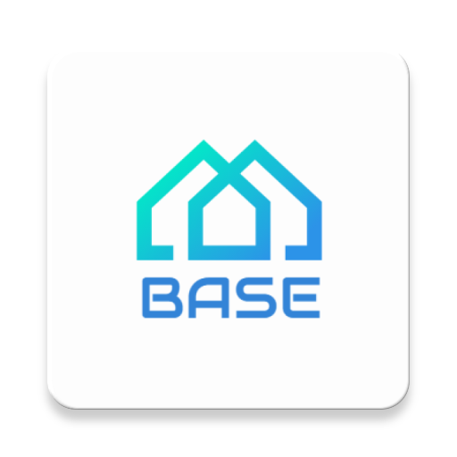

# Base



[](https://raw.githubusercontent.com/jenly1314/Base/master/app/release/app-release.apk)
[](https://jitpack.io/#jenly1314/Base)
[](https://travis-ci.org/jenly1314/Base)
[](https://circleci.com/gh/jenly1314/Base)
[](https://android-arsenal.com/api?level=15)
[](http://www.apache.org/licenses/LICENSE-2.0)

Base是针对于Android开发封装好一些常用的基类，主要包括通用的Adapter、Activity、Fragment、Dialog等、和一些常用的Util类，只为更简单。

> Base 3.x 在[Base 2.x](https://github.com/jenly1314/Base/tree/2.x) 的基础上进行了重构，最大的变化是将base-adapter和base-util提取了出来。

> 单独提取library主要是为了模块化，使其更加独立。在使用时需要用哪个库就引入库，这样就能尽可能的减少引入库的体积。

* base 主要是封装了常用的Activity、Fragment、DialogFragment、Dialog等作为基类，方便使用。
* base-adapter 主要是封装了各种Adapter、简化自定义Adapter步骤，让写自定义适配器从此更简单。
* base-util 主要是封装了一些常用的工具类。

### [AndroidX version](https://github.com/jenly1314/Base/tree/androidx)

## Gif展示


> 你也可以直接下载 [演示App](https://raw.githubusercontent.com/jenly1314/Base/master/app/app-release.apk) 体验效果

## 引入

### Gradle:

1. 在Project的 **build.gradle** 或 **setting.gradle** 中添加远程仓库

    ```gradle
    repositories {
        //...
        mavenCentral()
        maven { url 'https://jitpack.io' }
    }
    ```

2. 在Module的 **build.gradle** 里面添加引入依赖项

    ```gradle
    // base
    implementation 'com.github.jenly1314.Base:base:3.2.1'
    // adapter
    implementation 'com.github.jenly1314.Base:adapter:3.2.1'
    // util
    implementation 'com.github.jenly1314.Base:uitl:3.2.1'
    ```

## 使用

## 简要说明
Base主要实用地方体现在：出统一的代码风格，实用的各种基类，BaseActivity和BaseFragment里面还有许多实用的代码封装，只要用了Base，使用Fragment就感觉跟使用Activtiy基本是一样的。


## 代码示例

### 通用的Adapter
```Java
/**
  *
  * 只需继承通用的适配器（ViewHolderAdapter或ViewHolderRecyclerAdapter），简单的几句代码，妈妈再也不同担心我写自定义适配器了。
  */
public class TestAdapter extends ViewHolderAdapter<String> {


    public TestAdapter(Context context, List<String> listData) {
        super(context, listData);
    }

    @Override
    public View buildConvertView(LayoutInflater layoutInflater,T t,int position, ViewGroup parent) {
        return inflate(R.layout.list_item,parent,false);
    }

    @Override
    public void bindViewDatas(ViewHolder holder, String s, int position) {
        holder.setText(R.id.tv,s);
    }
}

```

### 基类BaseActivity
```Java
public class TestActivity extends BaseActivity {

    private TextView tv;
    private Button btn;

    @Override
    public void initUI() {
        //TODO:初始化UI
        setContentView(R.layout.activity_test);
        tv = findView(R.id.tv);
        btn = findView(R.id.btn);
    }

    @Override
    public void initData() {
        //TODO:初始化数据（绑定数据）
        tv.setText("text");
    }

}
```
### GestureActivity
```Java
public class TestGestureActivity extends GestureActivity {

    private TextView tv;
    private Button btn;

    @Override
    public void initUI() {
        //TODO:初始化UI
        setContentView(R.layout.activity_test);
        tv = findView(R.id.tv);
        btn = findView(R.id.btn);
    }

    @Override
    public void initData() {
        //TODO:初始化数据（绑定数据）
        tv.setText("text");
    }

    @Override
    public void onLeftFling() {
        //TODO:向左滑动
    }

    @Override
    public boolean onRightFling() {
        //TODO:向右滑动，默认执行finish，返回为true表示拦截事件。
        return false;
    }
}
```
### SplashActivity
```Java
public class TestSplashActivity extends SplashActivity {
    @Override
    public int getContentViewId() {
        return R.layout.activity_splash;
    }

    @Override
    public Animation.AnimationListener getAnimationListener() {
        return new Animation.AnimationListener() {
            @Override
            public void onAnimationStart(Animation animation) {

            }

            @Override
            public void onAnimationEnd(Animation animation) {
                //TODO: 启动动画结束，可执行跳转逻辑
            }

            @Override
            public void onAnimationRepeat(Animation animation) {

            }
        };
    }
}
```

### BaseFragment
```Java
public class TestFragment extends BaseFragment {
    @Override
    public int inflaterRootView() {
        return R.layout.fragment_test;
    }

    @Override
    public void initUI() {
        //TODO:初始化UI
    }

    @Override
    public void initData() {
         //TODO:初始化数据（绑定数据）
    }

}
```
### BaseDialogFragment
```Java
public class TestDialogFragment extends BaseDialogFragment {
    @Override
    public int inflaterRootView() {
        return R.layout.fragment_test_dialog;
    }

    @Override
    public void initUI() {
        //TODO:初始化UI
    }

    @Override
    public void initData() {
        //TODO:初始化数据（绑定数据）
    }


}
```

### WebFragment
```Java
    WebFragment实现基本webView功能
```
### 其他小功能

使用Log:
统一控制管理Log
```Java
 LogUtils.v();

 LogUtils.d();

 LogUtils.i();

 LogUtils.w();

 LogUtils.e();

 LogUtils.twf();

 LogUtils.println();
```

使用Toast
```Java
 showToast(CharSequence text);

 showToast(@StringRes  int resId);
```

使用Dialog
```Java
 showDialog(View v);
```
```Java
 showProgressDialog();

 showProgressDialog(@LayoutRes int resId);

 showProgressDialog(View v);
```
更多使用详情，请查看[app](app)中的源码使用示例或直接查看[API帮助文档](https://jitpack.io/com/github/jenly1314/Base/latest/javadoc/)

## 版本记录

#### v3.2.1：2019-7-1
*  优化部分细节，为迁移AndroidX版本做准备
*  支持AndroidX对应版本

#### v3.2.0：2019-5-28
*  统一版本，方便维护

#### v3.1.2: 很久以前…
*  未记录版本日志

## 赞赏
如果您喜欢Base，或感觉Base帮助到了您，可以点右上角“Star”支持一下，您的支持就是我的动力，谢谢 :smiley:
<p>您也可以扫描下面的二维码，请作者喝杯咖啡 :coffee:

<div>
   
</div>

## 关于我

| 我的博客                                                                                | GitHub                                                                                  | Gitee                                                                                  | CSDN                                                                                 | 博客园                                                                            |
|:------------------------------------------------------------------------------------|:----------------------------------------------------------------------------------------|:---------------------------------------------------------------------------------------|:-------------------------------------------------------------------------------------|:-------------------------------------------------------------------------------|
| <a title="我的博客" href="https://jenly1314.github.io" target="_blank">Jenly's Blog</a> | <a title="GitHub开源项目" href="https://github.com/jenly1314" target="_blank">jenly1314</a> | <a title="Gitee开源项目" href="https://gitee.com/jenly1314" target="_blank">jenly1314</a>  | <a title="CSDN博客" href="http://blog.csdn.net/jenly121" target="_blank">jenly121</a>  | <a title="博客园" href="https://www.cnblogs.com/jenly" target="_blank">jenly</a>  |

## 联系我

| 微信公众号        | Gmail邮箱                                                                          | QQ邮箱                                                                              | QQ群                                                                                                                       | QQ群                                                                                                                       |
|:-------------|:---------------------------------------------------------------------------------|:----------------------------------------------------------------------------------|:--------------------------------------------------------------------------------------------------------------------------|:--------------------------------------------------------------------------------------------------------------------------|
| [Jenly666](http://weixin.qq.com/r/wzpWTuPEQL4-ract92-R) | <a title="给我发邮件" href="mailto:jenly1314@gmail.com" target="_blank">jenly1314</a> | <a title="给我发邮件" href="mailto:jenly1314@vip.qq.com" target="_blank">jenly1314</a> | <a title="点击加入QQ群" href="https://qm.qq.com/cgi-bin/qm/qr?k=6_RukjAhwjAdDHEk2G7nph-o8fBFFzZz" target="_blank">20867961</a> | <a title="点击加入QQ群" href="https://qm.qq.com/cgi-bin/qm/qr?k=Z9pobM8bzAW7tM_8xC31W8IcbIl0A-zT" target="_blank">64020761</a> |

<div>
   
</div>
